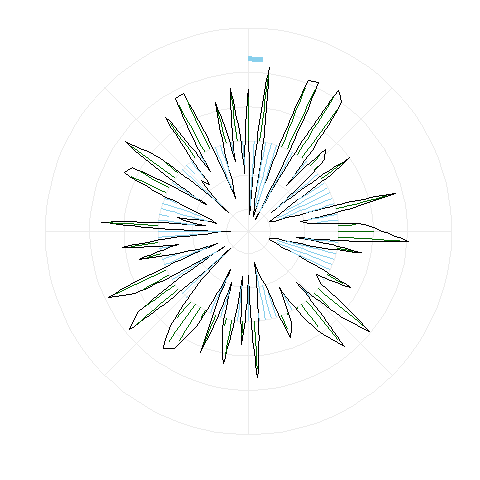
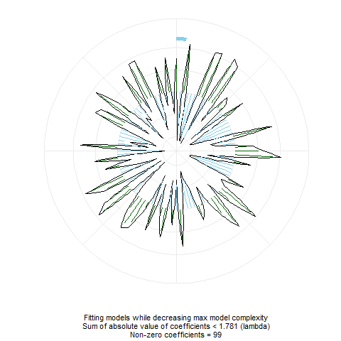
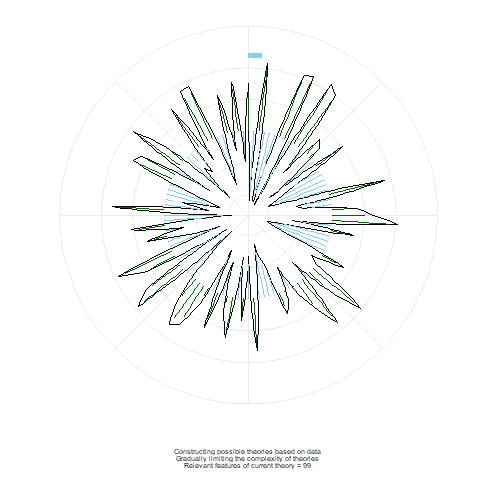
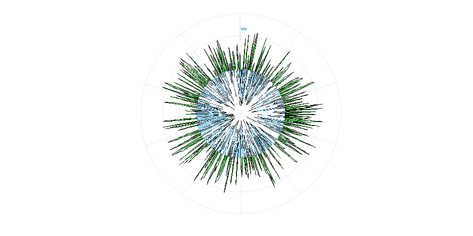
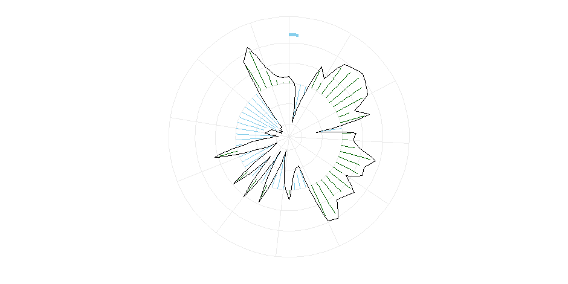

seeAI
================
Sondre U. Solstad

Visualizations of AI "thinking" in R
==========================

How do machines learn? I wrote a program that animates how a computer thinks. As we rely more and more on machines to make decisions, I believe that understanding - and seeing - how they formulate a theory to make that decision is important. This package provides functions for visualizing and animating AI / Machine Learning model construction processes. 

Written by Sondre U. Solstad, Princeton University (<ssolstad@princeton.edu>). Let me know if you find this package useful or want to suggest an improvement or feature.

Current function supports LASSO regression with cross-validation as implemented by the popular *glmnet* package. 


**Lasso coordinate descent and cross-validation:**




Installation instructions:

``` r
library(devtools)
install_github("sondreus/seeAI")
```


Example:
--------

``` r
library(seeAI)
library(glmnet)

set.seed(1010)
n=1000;p=100
nzc=trunc(p/10)
x=matrix(rnorm(n*p),n,p)
beta=rnorm(nzc)
fx= x[,seq(nzc)] %*% beta
eps=rnorm(n)*5
y=drop(fx+eps)
px=exp(fx)
px=px/(1+px)
ly=rbinom(n=length(px),prob=px,size=1)

set.seed(1011)
cvob1 <- cv.glmnet(x,y)

animate_glmnet(cvob1)

```

Arguments:
----------

-   **cv.glmnet** An object of class 'cv.glmnet'
-   **replay** Should the animation be replayed in the visual device? Defaults to FALSE.
-   **plot.cv** Should cross-validation error be plotted? Defaults to TRUE.
-   **total.time** Desired time of animation in seconds. Defaults to 15 if plot.cv selected, else 10.
-   **new.save** Should this animation be saved as a new object rather than overwrite the preceeding animation? Defaults to TRUE.
-   **save** Save as "html" or "gif"? Defaults to "html".
-   **debug** Only plot subset of lambda values? Defaults to FALSE.
-   **debug.n** If plotting subset of lambda values, sets number of values to plot. Defaults to 10. 
-   **captions** Should captions be added to animation? Defaults to FALSE. 
-   **captions.alt** Should alternative captions be added to animation? Defaults to FALSE.
-   **transition.n** How many frames should be used to transition between cross-validation and model fit? Defaults to 10.
-   **...** Options passed to saveHTML or saveGIF functions, such as "ani.width = 1000, ani.height = 500". See ?animate::saveHTML and ?animate::saveGIF

Explanation and detail
----------------------
Line segments are coefficients, outward from the central circle being positive and inward negative. As the complexity penalization parameter ("lambda") is increased, the size and number of non-zero coefficients decrease. Once the process is complete, a cross-validation procedure selects the ideal model (with the cross-validation error and the standard deviation of this error plotted on the right). Typically, the simplest model with the lowest cross-validation error or an error less than one standard deviation more than the model with the lowest the cross-validation error is preferred. 

With Captions (Alt. 1)
----------------------


With Captions (Alt. 2)
----------------------


Examples
----------------
AI generating a theory about what predicts victory in sports based on ~500 variables from 5000 matches.



AI generating a theory about what predicts if an email is spam or not based on ~50 variables and 4600 emails.




Acknowledgements
----------------

This package relies on the *glmnet* package by Jerome Friedman, Trevor Hastie, Noah Simon and Rob Tibshirani, the *animation* package by Yihui Xie, and *ggplot2* developed by Hadley Wickham, Winston Chang, Lionel Henry, Thomas Lin Pedersen, Kohske Takahashi, Claus Wilke, and Kara Woo.
